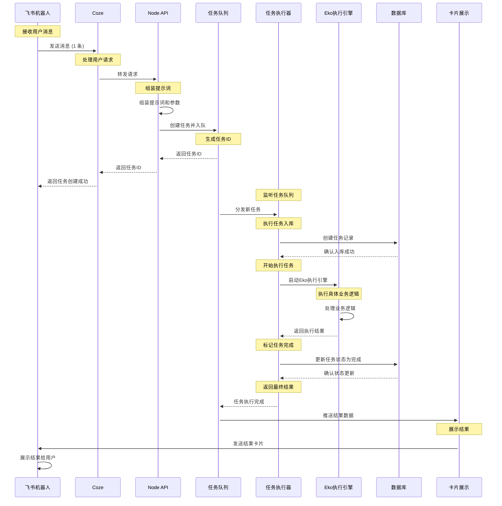

# 飞书机器人工作流程时序图

## 流程说明

1. **飞书机器人** 接收用户发送的消息
2. **Coze** 处理和理解用户请求
3. **Node API** 组装提示词和相关参数
4. **任务队列** 生成唯一任务ID并管理任务
5. **任务执行器** 监听队列并处理新任务
6. **数据库** 记录任务信息和状态
7. **Eko执行引擎** 执行具体的业务逻辑
8. **完成处理** 更新数据库状态并标记任务完成
9. **结果返回** 通过卡片形式展示给用户

## 关键节点

- **异步处理**: 任务入队后立即返回任务ID，实现异步执行
- **状态管理**: 数据库记录任务的完整生命周期
- **结果展示**: 通过卡片形式美观地展示执行结果
- **可靠性**: 任务队列确保任务不丢失，数据库记录确保状态可追踪 