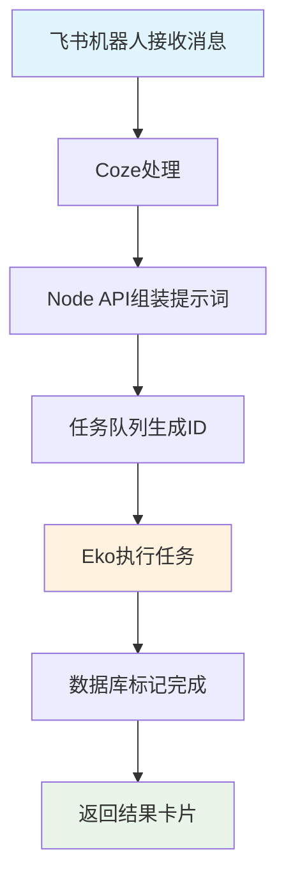

# 飞书机器人简化流程图

```mermaid
flowchart TD
    A[飞书机器人接收消息] --> B[Coze处理]
    B --> C[Node API组装提示词]
    C --> D[任务队列生成ID]
    D --> E[Eko执行任务]
    E --> F[数据库标记完成]
    F --> G[返回结果卡片]
    
    style A fill:#e1f5fe
    style G fill:#e8f5e8
    style E fill:#fff3e0
```

## 核心流程
1. **接收** → **处理** → **执行** → **完成** → **返回**
2. 异步处理，快速响应
3. 状态可追踪，结果可视化 